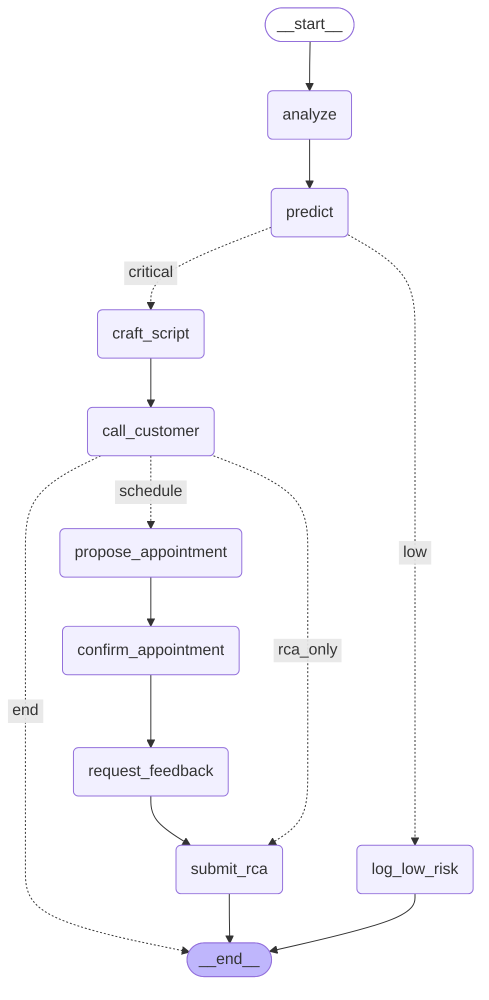

# AutoNexus AI: The Autonomous Service Ecosystem

**Welcome to our submission for the 'Automove [Hero + M&M]' Hackathon!**

AutoNexus AI is not just a predictive maintenance tool; it's an autonomous, agentic AI system designed to manage the entire vehicle service lifecycle. It acts as a "Master Agent" that orchestrates multiple worker agents to predict failures, proactively engage customers, manage service center operations, and provide a real-time feedback loop to manufacturing.




##  Our Innovative Edge

While any team can build a predictive model, our system creates new, emergent capabilities by having agents collaborate.

### 1. The Federated Fleet (Waze for Car Health)
Our system doesn't just treat cars in isolation. It creates a **collective immune system**.
* **Scenario:** Vehicle A hits a severe pothole, triggering its suspension sensors.
* **Our Solution:** The `MasterAgent` instantly correlates the g-force data, fault code, and GPS location. It then broadcasts a proactive "hazard" alert to all other vehicles on that same route, preventing fleet-wide damage.

### 2. Service-Center-as-a-Service (SCaaS)
Our `MasterAgent` doesn't just *ask* for appointments; it **runs the service center**.
* **Scenario:** The `DiagnosisAgent` forecasts a 40% spike in "brake pad" failures for the Mumbai region.
* **Our Solution:** The `MasterAgent` doesn't wait. It autonomously checks inventory, sees a low stock, and **executes a purchase order for more brake pads** *before* the cars even fail, transforming the center from reactive to predictive.

### 3. The Auto-Immune System (UEBA)
Our security isn't just a passive alarm; it's an **active self-healing mechanism**.
* **Scenario:** A `SchedulingAgent` is compromised and tries to access sensitive vehicle GPS history (anomalous behavior).
* **Our Solution:** The `UEBAGuard` instantly detects the anomaly, **quarantines the agent**, and triggers a workflow to a safe "manual approval" mode, ensuring 100% service uptime and security.

---

## System Architecture

Our solution is built on a **LangGraph-based Master Agent** that coordinates a team of specialized "Worker Agents":

* **`MasterAgent (Orchestrator)`:** The "brain" that manages the state and flow of the entire process using LangGraph.
* **`DataAnalysisAgent`:** Ingests and analyzes real-time telematics for anomalies.
* **`DiagnosisAgent`:** Uses ML models to predict component failures and assign a risk score.
* **`GeminiVoiceAgent`:** Our **Google Gemini-powered** customer concierge. It crafts and delivers empathetic, persuasive voice scripts to engage owners.
* **`SchedulingAgent`:** Manages all service center logistics, from finding slots to confirming bookings.
* **`ManufacturingAgent`:** Performs Root Cause Analysis (RCA) and pushes actionable insights back to the OEM to fix systemic flaws.
* **`UEBAGuard`:** The security officer, monitoring all agent-to-agent communication for anomalous or unauthorized actions.

---

## Technology Stack

* **Orchestration:** LangGraph
* **AI / LLM:** Google Gemini Flash 2.0
* **Backend Framework:** FastAPI
* **Web Server:** Uvicorn
* **Data Validation:** Pydantic 2.0
* **Core Libraries:** Langchain-core, Python-dotenv

---

## Quick Start

Get the app running on your machine in 2 minutes.

1.  **Set up a Virtual Environment** (Recommended)
    ```bash
    # Create a virtual environment
    python -m venv venv
    
    # Activate it
    # On macOS/Linux:
    source venv/bin/activate
    # On Windows:
    venv\Scripts\activate
    ```

2.  **Install Dependencies**
    ```bash
    pip install -r requirements.txt
    ```

3.  **Run the Server**
    ```bash
    # This command runs the app from main.py and auto-reloads on changes
    uvicorn main:app --reload
    ```

4.  **Test It!**
    Your server is now running. Open these links in your browser:
    * **API Docs (Swagger):** `http://localhost:8000/docs`
    * **Run Full Demo:** `http://localhost:8000/demo`
        (This single link will trigger the entire test flow!)

---

## Project Structure

All our code is inside the `app/` directory. Here's where to find everything:

```
automotive_agent/
├── app/
│   ├── api.py           #  All API routes (@app.get, @app.post)
│   ├── orchestrator.py  # The MasterAgent class (old)
│   ├── schemas.py       # All Pydantic data models (Telematics, etc.)
│   ├── ueba.py          # The UEBAGuard class and security rules
|   |── orchestrator_graph.py # Orchestrator
|   |── graph_states.py # states of the agents
│   │
│   ├── agents/
│   │   ├── __init__.py
│   │   ├── clients.py   # ABSTRACT classes (the "interfaces") for agents
│   │   └── mocks.py     #  MOCK classes 
│   │
│   ├── config.py        # App settings (e.g., USE_MOCKS)
│   └── state.py         # In-memory "databases"
│
├── main.py              #  Runs the app with uvicorn
└── requirements.txt     # Project dependencies
```

How to Test (Hackathon Demo)

We've made it simple to demonstrate the full power of the system.

** 1. The Main Demo (http://localhost:8000/demo)**

This is the primary endpoint. Simply open this URL in your browser.

It triggers a pre-configured critical risk scenario (e.g., brake failure). You can watch your terminal to see the entire agentic workflow execute in real-time:
- ✅ Data Analyzed

- ✅ Critical Failure Predicted

- ✅ LangGraph Routes to Critical Path

- ✅ Gemini Crafts a Voice Script (Printed to console)

- ✅ Customer Call Simulated

- ✅ Appointment Auto-Scheduled

- ✅ RCA Sent to Manufacturing (Printed to console)

**2. The API Docs (http://localhost:8000/docs)**

See all available API endpoints, schemas, and test them live using the Swagger UI.

**3. The Security Dashboard (http://localhost:8000/ueba/alerts)**

Check this endpoint after running the demo to see the logs from our UEBAGuard. You can see how it logs every agent's actions and would flag any anomalies.


